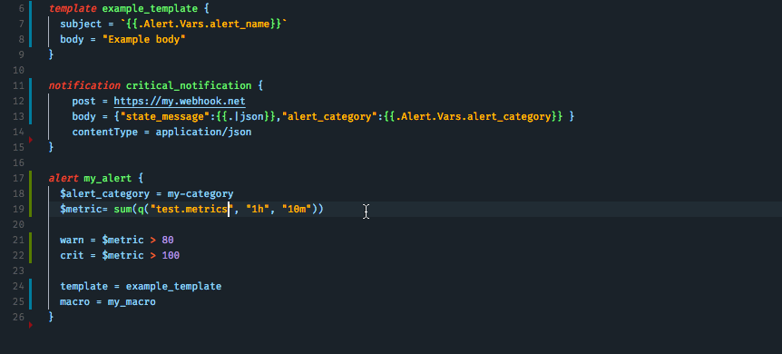

# Bosun Language Support

[](https://marketplace.visualstudio.com/items?itemName=tbutterwith.bosun)
[](https://marketplace.visualstudio.com/items?itemName=tbutterwith.bosun)


A [Bosun](https://bosun.org/) language pack for Visual Studio Code featurng syntax highlighting and code snippets.

[VS Marketplace](https://marketplace.visualstudio.com/items?itemName=tbutterwith.bosun)


## Syntax Highlighting


## OpenTSDB Metric Path Completion

\


### Configuration

The settings for OpenTSDB metric path completion are configured per workspace, allowing you to have a different OpenTSDB set up for each bosun project. The following configuration parameters are available:

```js
{
    "bosun": {
        "openTsdb": {
            "url": "<the url of your OpenTSDB api>",
            "port": 4242 // the port your OpenTSDB api is accessible on - default 4242
            "maxEntries": 500 // the number of metrics paths to fetch in the request - default 500
        }
        ...
    }
}
```

## Bosun Configuration Validation

This package provides access to the Bosun configuration testing api if provided with a url to a running instance of Bosun. The command can be found in the command palette `⌘ + ⇧ + P` and selecting `Bosun: Validate Bosun Configuration`. If there is an error in your config, the extensions provides an option to jump to the line with the error.

To configure this command, add the bosun url to your config:

```js
{
    "bosun": {
        "url": "<the url of your bosun instance>"
        ...
    }
}
```

## FAQ

### Changing the associated file extension

By default, files with a `.conf` extention are registered as bosun files. To mark a single file as a bosun file, use the language indicator or the language selection drop down using `⌘K M`. For more information see the vscode [guide](https://code.visualstudio.com/docs/languages/overview#_changing-the-language-for-the-selected-file).

To add more file extensions or replace the defaults add the follow snippet the user settings. For more information see the vscode [guide](https://code.visualstudio.com/docs/languages/overview#_adding-a-file-extension-to-a-language).

```json
"files.associations": {
        "*.conf": "bosun"
    }
```

### Autocompletion does not show all my metric paths

This could be caused by not returning enough paths from the `suggest` API. Try increasing the `maxEntries` setting.
