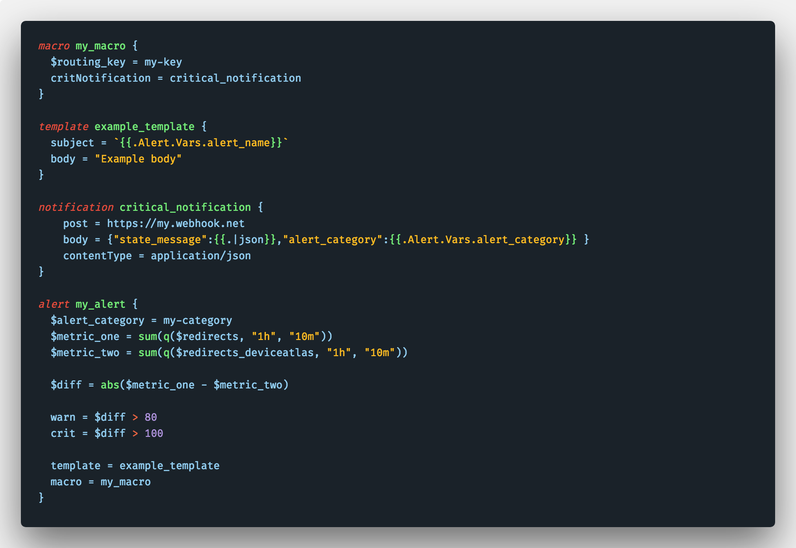

# Bosun Language Support


A [Bosun](https://bosun.org/) language pack for Visual Studio Code featurng syntax highlighting and code snippets.

[VS Marketplace](https://marketplace.visualstudio.com/items?itemName=tbutterwith.bosun)

[Github](https://github.com/tbutterwith/bosun-vscode)

## Syntax Highlighting




## FAQ

### Changing the associated file extension
By default, files with a `.conf` extention are registered as bosun files. To mark a single file as a bosun file, use the language indicator or the language selection drop down using `⌘K M`. For more information see the vscode [guide](https://code.visualstudio.com/docs/languages/overview#_changing-the-language-for-the-selected-file).

To add more file extensions or replace the defaults add the follow snippet the user settings. For more information see the vscode [guide](https://code.visualstudio.com/docs/languages/overview#_adding-a-file-extension-to-a-language).

```json
"files.associations": {
        "*.conf": "bosun"
    }
```